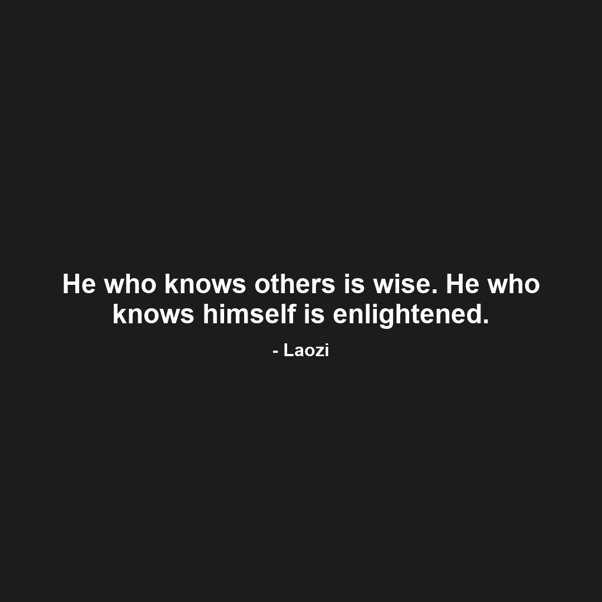

# 🖼️ Automated Quote Image Generator & Instagram Poster

This is a Python-based automation tool that **generates inspirational(on your choice) quote images** and **automatically posts them to Instagram**. Ideal for creators, influencers, or entrepreneurs looking to grow an audience through daily motivational content.

## ✨ Features

- 📜 Pulls quotes from APIs or custom quote lists
- 🖌️ Creates aesthetically pleasing quote images (with customizable styles)
- 🕓 Scheduled or on-demand posting
- 📱 Automatically uploads to Instagram (via Meta Graph API or third-party libraries)
- 🧠 Optional: Auto-selects background images or themes based on quote sentiment

## 🚀 Tech Stack

- **Python 3.10+**
- **Pillow** for image generation
- **Instagram Graph API** or `instagrapi` for posting
- **APScheduler** or `cron` for scheduling
- Optional: **OpenAI**, **Unsplash API**, or **TextBlob** for smart features

## 📸 Sample Output

| Generated Quote Image          |
|--------------------------------|
|  |

## How To

- **Use "session.py" to create your session based on your credentials.**

